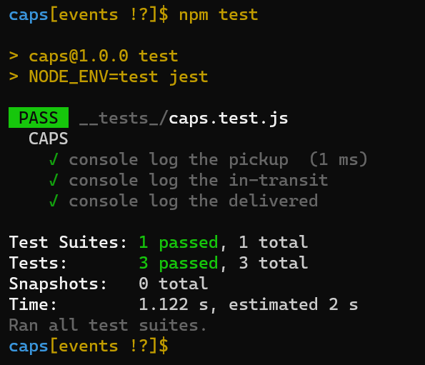
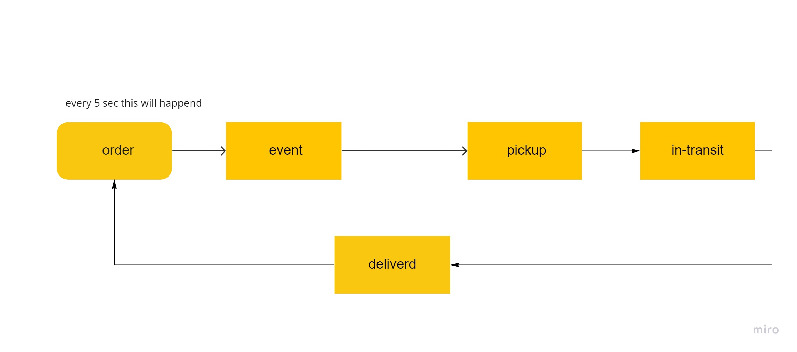

# caps

## Event Driven Applications

**CAPS Phase 1:**
*build an application for a product called CAPS - The Code Academy Parcel Service. In this sprint, we’ll build out a system that emulates a real world supply chain. CAPS will simulate a delivery service where vendors will ship products using our delivery service and when our drivers deliver them, each vendor will be notified that their customers received what they purchased.*

## Business Requirements for this code
- [x] As a vendor, I want to alert the system when I have a package to be picked up.
- [x] As a driver, I want to be notified when there is a package to be delivered.
- [x] As a driver, I want to alert the system when I have picked up a package and it is in transit.
- [x] As a driver, I want to alert the system when a package has been delivered.
- [x] As a vendor, I want to be notified when my package has been delivered.
- [x] As a developer, I want to use industry standards for managing the state of each package.
- [x] As a developer, I want to create an event driven system so that I can write code that happens in response to events, in real time.

## what I have in this code

+ at lip folder i have `event.js` 
+ at Module folder i have `driver.js`,`vender.js`
+ i have `csps.js` to Listens to ALL events in the Event Pool.and Logs a timestamp and the payload of every event.

## test action

## UML

+ [pull req]()
+ [actions]()